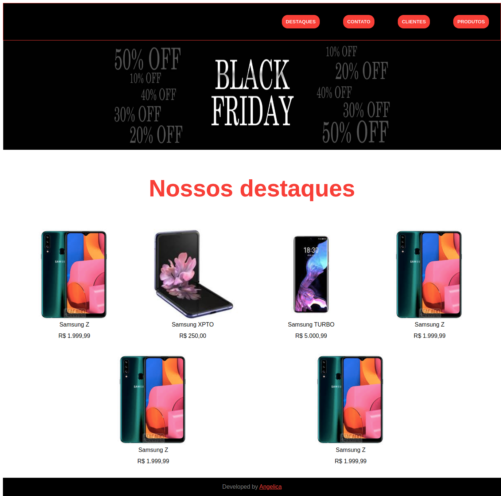
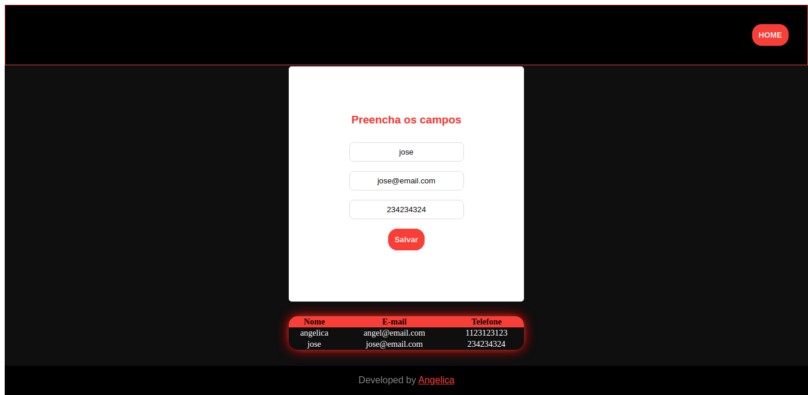
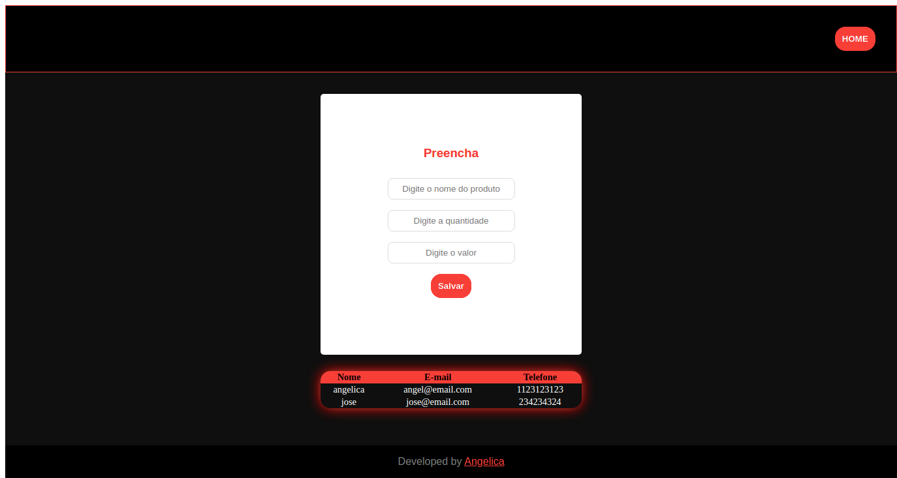

<h1 align="center">
  Gestão de Cadastros
</h1>

<p align="center">
  <a href="#-tecnologias">Tecnologias</a>&nbsp;&nbsp;&nbsp;|&nbsp;&nbsp;&nbsp;
  <a href="#-projeto">Projeto</a>&nbsp;&nbsp;&nbsp;|&nbsp;&nbsp;&nbsp;
  <a href="#-como-executar">Como executar</a>&nbsp;&nbsp;&nbsp;|&nbsp;&nbsp;&nbsp;
  <a href="#-deploy">Deploy</a>
</p>

<p align="center">
  
  
  
</p>

## 🔧 Tecnologias 

Esse projeto foi desenvolvido com as seguintes tecnologias:

- React

## 🚀 Como executar

Clone o projeto e acesse a pasta do mesmo.

```bash
$ git clone https://github.com/angelbotazoli/hiringcoders-gestao-de-cadastros.git
$ cd hiringcoders-gestao-de-cadastros
```

Para iniciá-lo, siga os passos abaixo:
```bash
# Baixar as dependências
$ npm i

# Iniciar o projeto
$ yarn start
```

## :arrow_forward:  Deploy

[Gestão de Cadastros](https://elegant-gates-cd73ac.netlify.app/)

## 💻 Projeto

Site de cadastro de clientes e produtos

<br>

---
Desenvolvido durante [hiringcoders2](https://www.hiringcoders.com.br/)
